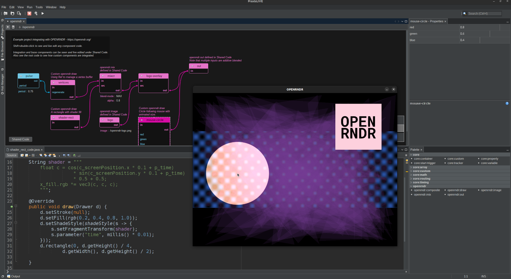

# Exploring OPENRNDR in PraxisLIVE

This project demonstrates integration with OPENRNDR using a custom root with custom components. OPENRNDR is an open source framework for creative coding - see https://openrndr.org/  It can be used as an example and as a base for customization.

## Structure

The [project.pxp](OPENRNDR/project.pxp) file contains the Maven Central links for the OPENRNDR libraries. These will automatically be downloaded using the PraxisCORE library support when the project is first run. This file also contains configuration to run the `openrndr` root in a separate VM, similar to the built-in video root type. In the IDE these settings can be found in the project properties dialog.

The [openrndr.pxr](OPENRNDR/openrndr.pxr) root file contains all the other configuration. The basic integration with OPENRNDR is contained within the custom root code, as well as the root's Shared Code space. Some custom types are predefined and registered in the root, including base `openrndr:draw` and `openrndr:composite` types for extension, as well as an `openrndr:image` component for loading still images and an `openrndr:mix` component for blending channels. Data pipes are used to pass OPENRNDR surfaces around the component graph, with caching and mixing controlled within the root code.

All components and their base types in the Shared Code space can be rewritten as they run.

Some utility functions are included and statically imported from `SHARED.OPENRNDR` to ease translation from Java to OPENRNDR's Kotlin API.

